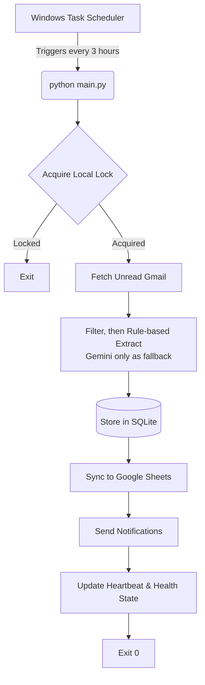

# 🎓 Placement Mail Tracker


**Placement Mail Tracker** is a robust, lightweight, and self-healing Python automation system designed for university students and job seekers. It securely monitors your Gmail inbox for placement and internship opportunities, extracts key structured details using Google Gemini AI, stores the records locally in SQLite, and seamlessly synchronizes them to a Google Sheet. 

It is specifically engineered to run as a **zero-touch, one-shot batch process** via Windows Task Scheduler.

---

## ✨ Core Features

- **📧 Automated Email Monitoring:** Securely reads your inbox using the official Google Gmail API (OAuth2).
- **🧠 AI-Powered Extraction:** Leverages Google Gemini AI to intelligently parse unstructured emails and extract structured data (company name, role, deadlines, eligibility).
- **🗄️ Resilient Local Storage:** Persists all discovered opportunities to a local SQLite database with strict transactional safety.
- **📊 Google Sheets Synchronization:** Automatically syncs extracted data to your personal Google Sheet. Handles rate limits and offline states gracefully.
- **🔔 Smart Notifications:** Sends failure alerts and summaries via SMTP Email (and is designed to support Telegram).
- **🛡️ Self-Healing & Reliability:** Includes a single-instance lock, heartbeat tracking, offline recovery, token corruption healing, and consecutive failure alerting.

---

## 🏗️ Architecture & Runtime Model

The production runner operates on a straightforward one-shot model. It does not use background workers, Celery, Redis, or infinite loops, making it extremely resource-efficient.



---

## 🚀 Quick Setup Guide

For comprehensive, step-by-step instructions, including Google Cloud setup and Task Scheduler configuration, please refer to the [📖 Operations & User Manual](USER_MANUAL.md).

### 1. Prerequisites
- **Python 3.10+**
- A Google Cloud Console Account (to enable Gmail & Sheets APIs)
- A Google Gemini API Key

### 2. Installation
```powershell
# Create and activate a virtual environment
python -m venv .venv
.venv\Scripts\Activate.ps1

# Install dependencies
pip install -r requirements.txt
```

### 3. Configuration
1. Copy the environment template:
   ```powershell
   cp .env.example .env
   ```
2. Update `.env` with your Google Gemini API key, Google Sheet ID, and SMTP credentials.
3. Download your Google Cloud Desktop OAuth Credentials and save them as `config/credentials.json`.
4. **Create `config/user_profile.json`** with your real details — eligibility
   filtering (which decides the Active vs Filtered tab) depends on it. If the
   file is missing, a default profile is used and a warning is logged.
   ```json
   {
     "degree": "B.Tech",
     "branch": "Computer Science",
     "campus": "Vellore",
     "graduation_year": 2027,
     "cgpa": 8.0
   }
   ```

### 4. First-Time Run
Execute the main script. A browser window will open asking you to grant the application access to your Gmail and Google Sheets.
```powershell
python main.py
```
*Once authenticated, secure OAuth tokens are saved locally in `config/`. You will not need to authenticate again.*

---

## ⚙️ Environment Modes

You can control the application's strictness by setting `APP_ENV` in your `.env` file:

- `production`: **(Default)** Validates all required credentials (Gmail, Sheets, Gemini, DB) at startup. Fails fast if anything is missing.
- `development`: Missing credentials log as warnings, allowing you to test specific modules locally without a full setup.
- `testing`: Optimized for the automated test suite.

**Exit Codes:**
- `0`: Success
- `1`: Critical Failure
- `2`: Partial Success (e.g., ran successfully but encountered warnings or rate limits)

---

## 📊 Your Spreadsheet

The tracker maintains four tabs, designed to be read at a glance (most
actionable columns first, human-readable dates in your local time):

- **Active Opportunities** — drives you are eligible for. Columns:
  `Company · Role · Type · Status · Priority · Action Required · Deadline ·
  Days Left · Next Event · Package · Location · CGPA Cutoff · Branches ·
  Eligibility · My Status · Apply Link · Email · History · Last Updated · Drive ID`.
- **Filtered Opportunities** — same columns, for drives you are *not* eligible
  for (wrong branch/degree/CGPA).
- **Company History** — per-company totals (drives, selected, rejected, active).
- **Dashboard** — at-a-glance counts: Action Required, Deadlines This Week,
  OA/Interviews This Week, Offers, Selection Rate, etc.

**`My Status` is yours to edit.** Mark a drive `Applied` / `Shortlisted` /
`Selected` etc. directly in the sheet — the tracker **preserves your edits**
across syncs and never overwrites them. Every other column is refreshed from
your inbox automatically. Use the column filter (enabled on row 1) to sort by
`Days Left`, `Deadline`, or `Priority`. The `Drive ID` column is an internal
key kept last — you can hide it.

---

## 🩺 Reliability & Self-Healing

The system is designed to run unattended on a personal Windows machine and automatically recover from common failures:
- **`tracker.lock`**: Prevents concurrent runs if a previous sync cycle hangs or overlaps.
- **`system_health.json`**: Tracks consecutive failures. If failures exceed the `FAILURE_ALERT_THRESHOLD` (default: 3), an emergency SMTP alert is sent to the configured `NOTIFICATION_EMAIL`.
- **`heartbeat.json`**: Records the last successful sync. If the system stops running for more than 6 hours, an inactivity warning is logged upon the next execution.
- **Token Auto-Healing**: If power failures corrupt the OAuth JSON tokens, the system gracefully deletes them and safely aborts rather than crashing indefinitely.

---

## 🧪 Testing & Auditing

The project includes an extensive suite of unit, integration, and End-to-End (E2E) tests.

**Run the Full Test Suite:**
```powershell
python -m pytest
```

**Run the Linter (same check CI runs):**
```powershell
ruff check .
```

---

## 📁 Project Structure

```text
placement-mail-tracker/
├── config/              # Google OAuth credentials and tokens
├── data/                # SQLite database and health/heartbeat/fetch state
├── logs/                # Rotating application and scheduler logs
├── scripts/             # Utility scripts (.bat wrapper)
├── src/
│   └── placement_mail_tracker/
│       ├── ai/          # Gemini extraction (fallback) + Pydantic models
│       ├── config/      # Settings, validation, user profile
│       ├── db/          # SQLite schema, manager, connection, migration
│       ├── extraction/  # Rule-based extraction, classification, eligibility
│       ├── gmail/       # Gmail API client + relevance filters
│       ├── notifications/ # SMTP email notifier (Telegram stub)
│       ├── reliability/ # Health, heartbeat, run status
│       ├── scheduler/   # Run-cycle orchestrator, digest, alerts
│       ├── sheets/      # Google Sheets sync
│       └── utils/       # Dedup, scoring, lock, time, logging, trusted senders
├── tests/               # Pytest suite
├── CLAUDE.md            # Engineering operating guide
├── .env                 # Environment variables
├── main.py              # Application entry point
└── USER_MANUAL.md       # Detailed operations guide
```
